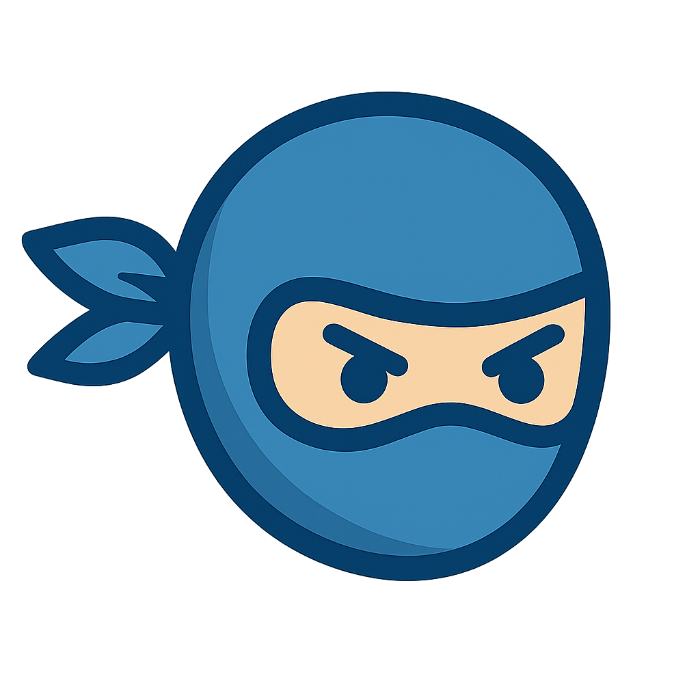
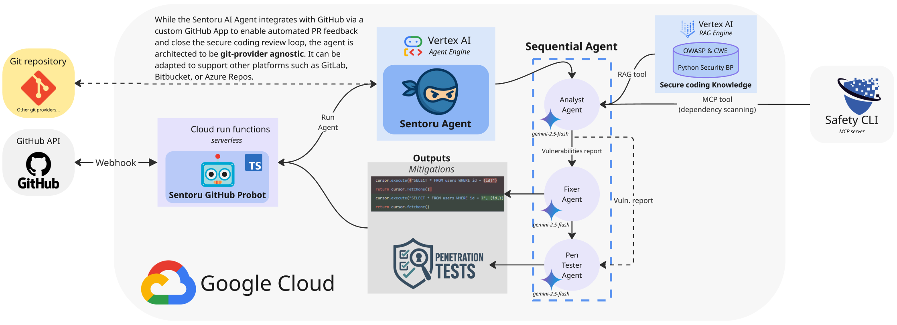

<table>
  <tr>
    <td></td>
    <td><h1>🔐🥷 Sentoru Agent – Secure Coding for the AI Era</h1></td>
  </tr>
</table>

**Sentoru** is an AI **secure coding** agent designed to enforce cybersecurity best practices across your pull requests (PRs). By leveraging a multi-agent system, Sentoru automatically analyzes, fixes, and generates penetration tests for your code to ensure every PR meets enterprise‑grade security standards.

## 🚀 Key Features

- **Cybersecurity‑first PR workflows** – Automatically scans PRs for vulnerabilities and injects secure coding checks directly into your GitHub CI/CD pipeline.
- **AI‑augmented security** – In an era where "vibe coding" is accelerating development, rapidly generated AI code often skips deep security scrutiny. Sentoru fills this gap by **automatically verifying, hardening, and generating tests** for AI-generated code—ensuring that fast innovation doesn't come at the cost of vulnerabilities.
- **Automated Fixes & Pentests** – Goes beyond simple analysis by suggesting fixes as code commits and generating penetration tests to validate the solution's robustness.
- **Developer Control & Flexibility** – Sentoru doesn't force changes. You choose when its security suggestions, fixes, or attack tests are relevant—opting in or out on a per-PR or per-repository basis. You stay in command.

## Architecture

 
*(This README reflects the latest architecture diagram provided)*

## 🛡️ Why It Matters

1.  **Vibe coding**—coding by prompting AI—is gaining traction. While it's fast and intuitive, it also introduces frequent security vulnerabilities.
2.  Research shows **30%–50% of AI‑generated code** contains security flaws like SQL injection, XSS, and authentication weaknesses.
3.  Sentoru closes the secure‑coding feedback loop: code generated by AI is immediately analyzed, fixed, and validated—so you can merge with confidence.

## How It Works: A Multi-Agent System

Sentoru operates as a sequence of specialized AI agents, each with a distinct role in the security workflow. This multi-agent system ensures a thorough and structured approach to securing your code.

1.  **Analyst Agent**:
    *   **Responsibility**: This is the first agent in the chain. It analyzes the code changes in a pull request to identify potential security vulnerabilities.
    *   **Tools**:
        *   `get_safety_API_tool`: Checks for known vulnerabilities in `requirements.txt` or `pyproject.toml` using the [Safety CLI](https://www.getsafety.com/cli) vulnerability database.
        *   `get_rag_vulnerability_knowledge_tool`: Consults a knowledge base of cybersecurity guidelines and best practices using Retrieval-Augmented Generation (RAG) on Vertex AI to provide context on relevant vulnerabilities for the new code changes.
    *   **Output**: A detailed analysis report of its findings.

2.  **Fixer Agent**:
    *   **Responsibility**: This agent takes the `Analyst Agent`'s report and generates code patches to fix the identified vulnerabilities.
    *   **Method**: It follows a detailed prompt that instructs it to create suggestions in the GitHub-approved patch format, including comments that explain the vulnerability and the fix.
    *   **Output**: A JSON object containing an array of code patches and a summary comment.

3.  **Pentester Agent**:
    *   **Responsibility**: The final agent in the sequence. It validates that the patches from the `Fixer Agent` are secure and don't introduce new flaws.
    *   **Method**: It adopts an adversarial mindset to write `pytest` unit tests that act as penetration tests, simulating the original attack vector to ensure the fix is robust.
    *   **Output**: A new test file containing the penetration tests, along with an explanation of the tests.


This sequential process ensures that every pull request is analyzed, fixed, and validated before it gets merged.

### Current State and Future Vision

In its current implementation, the Sentoru agent completes the full analysis-fix-pentest cycle. The `Fixer Agent` commits its suggested changes directly to the PR for developer approval. The `Pentester Agent` then generates the necessary `pytest` code to validate these fixes.

**Next Steps (Work in Progress):** The current architecture is designed for a fully autonomous, closed-loop security cycle. Our roadmap includes creating a secure execution environment to automatically run the generated penetration tests. If a test fails, the system will trigger a recursive loop, sending the failure report back to the `Fixer Agent` for another attempt at patching the vulnerability. This iterative process will continue until the code is verifiably secure, achieving a true "closed-loop" security model.

### The RAG Knowledge Base

The power of the `Analyst Agent` comes from its sophisticated knowledge base built on **Google Cloud's Vertex AI Search**. The pipeline uses **Gemini 2.5 Flash** to intelligently parse a vast corpus of security documents (OWASP Top 10, CWE, etc.) and vectorize them with the `text-embedding-005` model. Key documents like *Python Security Best Practices* were generated using Gemini's deep research capabilities, ensuring comprehensive and up-to-date knowledge.

## How Sentoru Stands Out

Sentoru combines the strengths of multiple security tool categories into a single, open, and developer-centric agent.

| Tool/Agent | Multi-Agent Architecture | Security Analysis (Static) | Suggests & Commits Fixes | Generates Penetration Tests | PR Integration (GitHub) | Explainability (Comments, Docs) | LLM-Generated Code Focus | Open Source & Customizable |
| :--- | :---: | :---: | :---: | :---: | :---: | :---: | :---: | :---: |
| **Sentoru** | ✅ | ✅ | ✅ | ✅ | ✅ | ✅ | ✅ | ✅ |
| Snyk Code + AI Fix | ❌ | ✅ | ✅ | ❌ | ✅ | ✅ | ⚠️ | ❌ |
| GitHub CodeQL | ❌ | ✅ | ❌ | ❌ | ✅ | ✅ | ❌ | ✅ |
| Argusee (Google Research) | ✅ | ✅ | ❌ | ✅ | ❌ | ⚠️ | ❌ | ✅ |
| Generic LLMs (ChatGPT, etc.) | ❌ | ⚠️ | ✅ | ❌ | ❌ | ✅ | ✅ | ✅ |

---

**Build faster. Secure smarter. Embrace AI with confidence.**

---

## ✅ Quick Start

### Installation

Before you begin, ensure you have the following prerequisites installed:
- **uv**: Python package manager - [Install](https://docs.astral.sh/uv/getting-started/installation/)
- **Google Cloud SDK**: For GCP services - [Install](https://cloud.google.com/sdk/docs/install)

1.  **Sync Python dependencies**

    Install the required Python packages using `uv`:

    ```bash
    uv sync
    ```

2.  **Create a Safety Account**

    Create an account on [Safety](https://www.getsafety.com/cli) and get your API key. You will need this for vulnerability scanning.

3.  **Set up environment variables**

    Create a `.env` file in the root of the project and add the following environment variables:

    ```env
    GOOGLE_CLOUD_PROJECT=<your-gcp-project-id>
    GOOGLE_GENAI_USE_VERTEXAI=True
    GOOGLE_CLOUD_LOCATION=us-central1
    LLM_DEPLOYMENT=gemini-2.0-flash
    SAFETY_API_KEY=<your-safety-mcp-apikey>
    ```

### Running the Agent

To run the agent locally for development and testing, the best way to try it out is by using the `notebooks/adk_app_testing.ipynb` notebook. Where you can either run the Agent flow locally or connect to the cloud resource running in Google Cloud's Vertex AI. In the notebook, you can experiment by providing different git diff files and inspect the JSON responses from the agent to see the security analysis, code fixes, and generated penetration tests.

> **Note**: A generic web interface is available by running `uv run adk web`, but it is not suitable for this agent. This agent requires specific session state, including a git diff, to be passed in, which is best handled through the testing notebook.