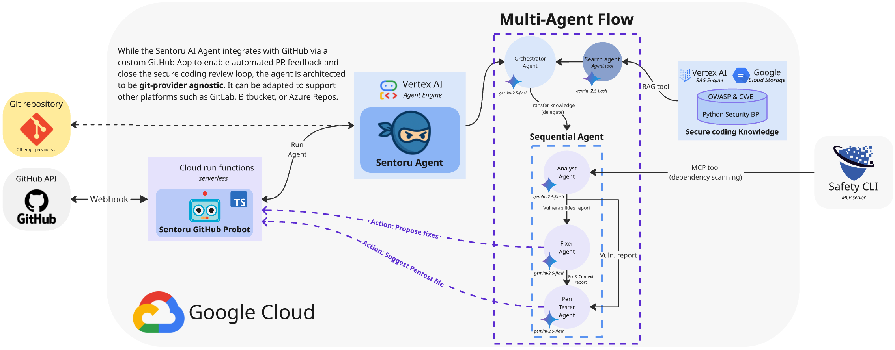

<table>
  <tr>
    <td></td>
    <td><h1>🔐🥷 Sentoru Agent – Secure Coding for the AI Era</h1></td>
  </tr>
</table>

**Sentoru** is an AI **secure coding** agent designed to enforce cybersecurity best practices across your pull requests (PRs). By leveraging a multi-agent system, Sentoru automatically analyzes, fixes, and generates penetration tests for your code to ensure every PR meets enterprise‑grade security standards.

## 🚀 Key Features

- **Cybersecurity‑first PR workflows** – Automatically scans PRs for vulnerabilities and injects secure coding checks directly into your GitHub CI/CD pipeline.
- **AI‑augmented security** – In an era where "vibe coding" is accelerating development, rapidly generated AI code often skips deep security scrutiny. Sentoru fills this gap by **automatically verifying, hardening, and generating tests** for AI-generated code—ensuring that fast innovation doesn't come at the cost of vulnerabilities.
- **Automated Fixes & Pentests** – Goes beyond simple analysis by suggesting fixes as ◊◊code commits and generating penetration tests to validate the solution's robustness.
- **Developer Control & Flexibility** – Sentoru doesn't force changes. You choose when its security suggestions, fixes, or attack tests are relevant—opting in or out on a per-PR or per-repository basis. You stay in command.

## Architecture

 


## 🛡️ Why It Matters

1.  **Vibe coding**—coding by prompting AI—is gaining traction. While it's fast and intuitive, it also introduces frequent security vulnerabilities.
2.  Research shows **30%–50% of AI‑generated code** contains security flaws like SQL injection, XSS, and authentication weaknesses.
3.  Sentoru closes the secure‑coding feedback loop: code generated by AI is immediately analyzed, fixed, and validated—so you can merge with confidence.

## How It Works: A Multi-Agent System

Sentoru operates as a hierarchical multi-agent system with specialized AI agents, each with a distinct role in the security workflow. This architecture ensures a thorough and structured approach to securing your code through intelligent orchestration and sequential processing.

1.  **Orchestrator Agent**:
    *   **Responsibility**: The master coordinator that manages the entire security workflow and decides which tools and sub-agents to invoke based on the configuration.
    *   **Tools** (when `USE_RAG` is enabled):
        *   **Search Agent**: A specialized sub-agent that performs RAG retrieval from the vulnerability knowledge base to gather relevant security context before the main analysis begins.
    *   **Output**: Coordinates the overall workflow and passes enriched context to the review pipeline.

2.  **Search Agent** (Optional - when RAG is enabled):
    *   **Responsibility**: Performs intelligent retrieval from the cybersecurity knowledge base to provide contextual security information relevant to the code changes.
    *   **Tools**:
        *   `get_rag_vulnerability_knowledge_tool`: Consults a knowledge base of cybersecurity guidelines and best practices using Retrieval-Augmented Generation (RAG) on Vertex AI.
    *   **Output**: A search report containing relevant vulnerability information and mitigation strategies.

3.  **Review Agent** (Sequential Pipeline):
    The orchestrator then invokes a sequential review pipeline consisting of three specialized agents:

    **3.1 Analyst Agent**:
    *   **Responsibility**: Analyzes the code changes in a pull request to identify potential security vulnerabilities, leveraging both the RAG-retrieved context (if available) and direct vulnerability scanning.
    *   **Tools**:
        *   `get_safety_API_tool`: Checks for known vulnerabilities in `requirements.txt` or `pyproject.toml` using the [Safety CLI](https://www.getsafety.com/cli) vulnerability database.
    *   **Output**: A detailed analysis report of security findings.

    **3.2 Fixer Agent**:
    *   **Responsibility**: Takes the Analyst Agent's report and generates code patches to fix the identified vulnerabilities.
    *   **Method**: Follows a detailed prompt that instructs it to create suggestions in the GitHub-approved patch format, including comments that explain the vulnerability and the fix.
    *   **Output**: A JSON object containing an array of code patches and a summary comment.

    **3.3 Pentester Agent**:
    *   **Responsibility**: The final agent in the sequence that validates the patches from the Fixer Agent are secure and don't introduce new flaws.
    *   **Method**: Adopts an adversarial mindset to write `pytest` unit tests that act as penetration tests, simulating the original attack vector to ensure the fix is robust.
    *   **Output**: A new test file containing the penetration tests, along with an explanation of the tests.

This hierarchical orchestration ensures that every pull request benefits from contextual security knowledge (when RAG is enabled) and then undergoes thorough analysis, fixing, and validation through the sequential review pipeline.

### Current State and Future Vision

In its current implementation, the Sentoru agent completes the full analysis-fix-pentest cycle. The `Fixer Agent` commits its suggested changes directly to the PR for developer approval. The `Pentester Agent` then generates the necessary `pytest` code to validate these fixes.

**Next Steps (Work in Progress):** The current architecture is designed for a fully autonomous, closed-loop security cycle. Our roadmap includes creating a secure execution environment to automatically run the generated penetration tests. If a test fails, the system will trigger a recursive loop, sending the failure report back to the `Fixer Agent` for another attempt at patching the vulnerability. This iterative process will continue until the code is verifiably secure, achieving a true "closed-loop" security model.

### The RAG Knowledge Base

The power of the `Analyst Agent` comes from its sophisticated knowledge base built on **Google Cloud's Vertex AI Search**. The pipeline uses **Gemini 2.5 Flash** to intelligently parse a vast corpus of security documents (OWASP Top 10, CWE, etc.) stored in **Google Cloud Storage** and vectorize them with the text-embedding-005 model. Key documents like *Python Security Best Practices* were generated using **Gemini's Deep Research** capabilities, ensuring comprehensive and up-to-date knowledge.

## How Sentoru Stands Out

Sentoru combines the strengths of multiple security tool categories into a single, open, and developer-centric agent.

| Tool/Agent | Multi-Agent Architecture | Security Analysis (Static) | Suggests & Commits Fixes | Generates Penetration Tests | PR Integration (GitHub) | Explainability (Comments, Docs) | LLM-Generated Code Focus | Open Source & Customizable |
| :--- | :---: | :---: | :---: | :---: | :---: | :---: | :---: | :---: |
| **Sentoru** | ✅ | ✅ | ✅ | ✅ | ✅ | ✅ | ✅ | ✅ |
| Snyk Code + AI Fix | ❌ | ✅ | ✅ | ❌ | ✅ | ✅ | ⚠️ | ❌ |
| GitHub CodeQL | ❌ | ✅ | ❌ | ❌ | ✅ | ✅ | ❌ | ✅ |
| Argusee (Google Research) | ✅ | ✅ | ❌ | ✅ | ❌ | ⚠️ | ❌ | ✅ |
| Generic LLMs (ChatGPT, etc.) | ❌ | ⚠️ | ✅ | ❌ | ❌ | ✅ | ✅ | ✅ |

---

**Build faster. Secure smarter. Embrace AI with confidence.**

---

## 🎥 See It In Action

Check out our demo video to see Sentoru in action: **[Watch Demo on YouTube](https://www.youtube.com/watch?v=w-aS35DFAQo)**

---

## ✅ Quick Start

### GitHub App Installation (Recommended)

For the easiest setup, install the **Sentoru GitHub App** directly in your repositories:

**🚀 [Install Sentoru GitHub App](https://github.com/apps/sentoru-ai)**

Once installed, Sentoru will automatically analyze your pull requests and provide security feedback, fixes, and penetration tests.

### Local Development Setup

For local development and testing, follow these steps:

#### Prerequisites

Before you begin, ensure you have the following prerequisites installed:
- **uv**: Python package manager - [Install](https://docs.astral.sh/uv/getting-started/installation/)
- **Google Cloud SDK**: For GCP services - [Install](https://cloud.google.com/sdk/docs/install)

1.  **Sync Python dependencies**

    Install the required Python packages using `uv`:

    ```bash
    uv sync
    ```

2.  **Create a Safety Account**

    Create an account on [Safety](https://www.getsafety.com/cli) and get your API key. You will need this for vulnerability scanning.

3.  **Set up environment variables**

    Create a `.env` file in the root of the project and add the following environment variables:

    ```env
    GOOGLE_CLOUD_PROJECT=<your-gcp-project-id>
    GOOGLE_GENAI_USE_VERTEXAI=True
    GOOGLE_CLOUD_LOCATION=us-central1
    LLM_DEPLOYMENT=gemini-2.5-flash
    SAFETY_API_KEY=<your-safety-mcp-apikey>
    VULN_RAG_CORPUS=<your-rag-corpus-resource-name>
    USE_RAG=true
    ```

    **Note**: `VULN_RAG_CORPUS` should be set to your Vertex AI RAG Engine resource name in Google Cloud (e.g., `projects/your-project/locations/us-central1/ragCorpora/your-corpus-id`). The `USE_RAG` environment variable must also be set to enable RAG capabilities for local development and testing.

### Running the Agent

To run the agent locally for development and testing, the best way to try it out is by using the `notebooks/adk_app_testing.ipynb` notebook. Where you can either run the Agent flow locally or connect to the cloud resource running in Google Cloud's Vertex AI. In the notebook, you can experiment by providing different git diff files and inspect the JSON responses from the agent to see the security analysis, code fixes, and generated penetration tests.

> **Note**: A generic web interface is available by running `uv run adk web`, but it is not suitable for this agent. This agent requires specific session state, including a git diff, to be passed in, which is best handled through the testing notebook.

### 🚨 Important: RAG Deployment Limitation

**When deploying Sentoru to Vertex AI Reasoning Engine, you MUST disable RAG capabilities** by ensuring the `USE_RAG` environment variable is **not set**. This is due to a known issue with the ADK Python library.

#### The Issue

When deploying agents that use `VertexAiRagRetrieval` to Vertex AI Reasoning Engine, the deployed agent consistently returns zero events (`[]`) from `stream_query()`, causing the RAG functionality to fail silently. This issue is documented in the [ADK Python GitHub repository](https://github.com/google/adk-python/issues/496).

**Error behavior:**
- ✅ **Local execution**: RAG capabilities work perfectly fine
- ✅ **Local execution**: Non-RAG tools work perfectly fine  
- ✅ **Vertex AI deployment**: Non-RAG tools work perfectly fine
- ❌ **Vertex AI deployment**: RAG tools return empty results

#### Workaround

To deploy Sentoru to production on Vertex AI:

1. **Disable RAG** by not setting the `USE_RAG` environment variable:
   ```bash
   # Do NOT set USE_RAG when deploying to Vertex AI
   # unset USE_RAG
   ```

2. **Verify RAG is disabled** in your deployment configuration - the agent will automatically fall back to using only the Safety API tool for vulnerability scanning.

3. **Test locally first** with `USE_RAG=true` to validate the full RAG functionality works in your development environment.

This limitation only affects the RAG-based vulnerability knowledge retrieval. All other security analysis features (Safety API vulnerability scanning, code fixing, and penetration test generation) work perfectly in both local and deployed environments.
